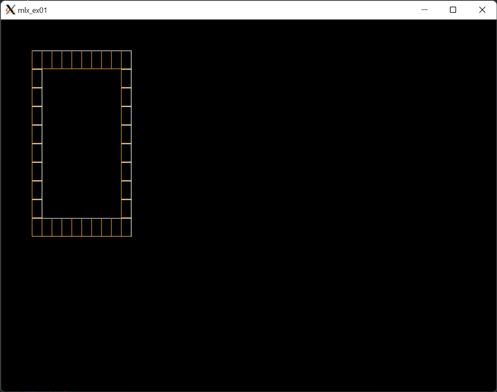

# Bresenham algorithm and mlx library 🚧 under development 🚧



On this Projec You will note the `window->img ` size is assigned to the `map_info->img_wide` and `map_info->img_high` function.

This Changes the size  will effect at bpp and the size of the image, but not the size of the window.

How This happens:

Imagine that if we use a window size of `800 * 600`:
```
bpp = 800*600*4 = 32000
size_line = 32000/4 = 800
```
If we want to use a image size of `300 * 300`:
```
bpp = 300*300*4 = 120000
size_line = 120000/4 = 300
```
OK, I think now its clear for you that the size of the image is not the size of the window.

Let us now see how the bresenham algorithm works.

```
0  0  0  0  0  0  0  0  0  0  0  0  0  0  0  0  0  0  0
0  0  0  0  0  0  0  0  0  0  0  0  0  0  0  0  0  0  0
0  0  1  1  0  0  1  1  0  0  0  1  1  1  1  1  0  0  0
0  0  1  1  0  0  1  1  0  0  0  0  0  0  0  1  1  0  0
0  0  1  1  0  0  1  1  0  0  0  0  0  0  0  1  1  0  0
0  0  1  1  1  1  1  1  0  0  0  0  1  1  1  1  0  0  0
0  0  0  1  1  1  1  1  0  0  0  1  1  0  0  0  0  0  0
0  0  0  0  0  0  1  1  0  0  0  1  1  0  0  0  0  0  0
0  0  0  0  0  0  1  1  0  0  0  1  1  1  1  1  1  0  0
0  0  0  0  0  0  0  0  0  0  0  0  0  0  0  0  0  0  0
0  0  0  0  0  0  0  0  0  0  0  0  0  0  0  0  0  0  0
```

1: is Cube
0: is Empty

Cube is the pixel that is going to be drawn.

for each 1 will be
```
(x0, y0)--(dx)--(x1, y0)
 |                     
 |                     
(dy)                   
 |                     
 |                     
(x0, y1)--(dx)--(x1, y1)

```
**dy**: is the difference between the y0 and y1.
**dx**: is the difference between the x0 and x1.

OK , Now if check map the first 1 at array will be on (3, 3).

##### what is loctions for (3, 3) on pixel?
We need get **dx** and **dy**

- Step One: 
  - `img_wide = 300` and `img_high = 300`.
  - each 4 bytes is a pixel.
  - pixels =  `img_wide * img_high * 4` = `300 * 300 * 4 = 360000`
  - pixels / 4 = `360000 / 4 = 90000`
  - thats means we will use 90000 pixels each one have 4 bytes.

Now have 90000 pixles to draw map size is (18, 10).
- Step two:
  - dx = `img_wide` \ `map_wide` =  `300 / 18 = 16.6`
  - dy = `img_high` \ `map_high` =  `300 / 10 = 30.0`

Ok now we know `x0` to `x1` will be `x0 + dx` and loctions for (3, 3) will be (3*dx, 3*dy).
```
(3, 3) -> pixel = (3*dx, 3*dy) = (3 * 16, 3 * 30.0) = (48, 90)
```
Now i have pixel loction is(48, 90).

To drwa at `window->data`

```c
window->data[90*window->img_wide + 48] = 0xffffffff;
```